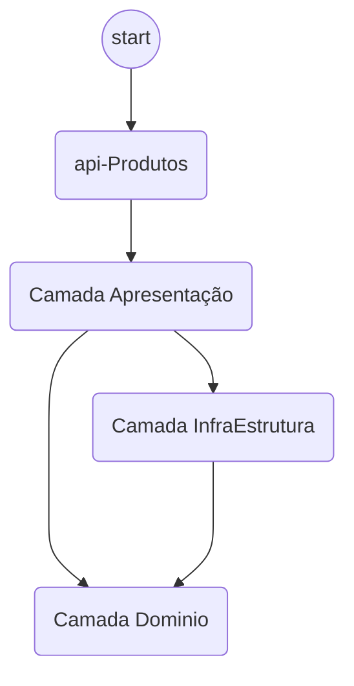

# Projeto de API Utilizando Minimal API com .NET 8.0
Este projeto tem como objetivo demonstrar algumas funcionalidades do .NET 8 em um cenário de projeto realista.

## Bibliotecas Utilizadas
Este projeto está utilizando os seguintes pacotes.
- Refit
- FluentValidation
- MySql.EntityFrameworkCore
- Microsoft.EntityFramework.InMemory
- RabbitMq.Client
- Moq
- FluentAssertions
- Swashbuckle.AspNetCore

## Estrutura do Projeto API Produtos


## Estrutura do Projeto API Pedidos

## Rodando a aplicação local
 Para executar a aplicação localmente é necessário ter o docker instalado para levantar o banco de dados e também a fila RabbitMq.

```bash
docker compose up
```
